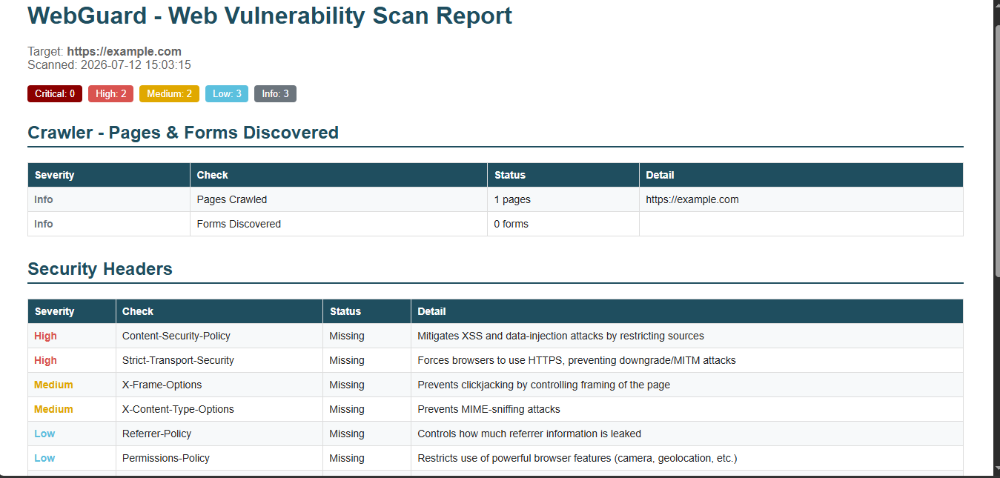

# 🛡️ WebGuard — Modular Web Vulnerability Scanner

<p align="left">
  
  
  
  
  
</p>

**WebGuard** is a lightweight, modular web application vulnerability scanner — the active, application-layer sibling of **ReconX**. It crawls a target site, maps its attack surface, and runs a series of independent, non-destructive checks for common OWASP-class vulnerabilities, producing a severity-rated report at the end.

---

## 📌 Table of Contents

- [Overview](#-overview)
- [Objectives](#-objectives)
- [Scope & Limitations](#-scope--limitations)
- [Features](#-features)
- [Project Structure](#-project-structure)
- [Architecture](#-architecture)
- [Technology Stack](#-technology-stack)
- [Prerequisites](#-prerequisites)
- [Installation](#-installation)
- [Usage](#-usage)
- [Module Details](#-module-details)
- [Reporting](#-reporting)
- [Sample Output](#-sample-output)
- [Testing & Performance](#-testing--performance)
- [Troubleshooting / FAQ](#-troubleshooting--faq)
- [Roadmap](#-roadmap)
- [Contributing](#-contributing)
- [Team & Credits](#-team--credits)
- [Acknowledgments](#-acknowledgments)
- [Disclaimer](#-disclaimer)
- [License](#-license)

---

## 🧭 Overview

WebGuard automates the application-layer vulnerability assessment phase of a penetration test. It spiders a target domain to discover pages and HTML forms, then tests what it finds for missing security headers, insecure cookies, reflected XSS, and error-based SQL injection — packaging everything into a clean, severity-rated report.

## 🎯 Objectives

- Build a modular CLI web vulnerability scanner
- Automate detection of common OWASP Top 10-class issues: XSS, SQLi, security misconfiguration, insecure cookies
- Provide a working crawler that feeds discovered forms/parameters into downstream test modules
- Generate clean, severity-rated reports for penetration testers
- Keep every check non-destructive and safe for authorized testing

## 🔒 Scope & Limitations

WebGuard performs **detection only** — it identifies signals of vulnerability (e.g. an unescaped marker reflected in a response, or a database error string returned) but does not exploit, extract data, or modify anything on the target. Findings marked "Vulnerable (unconfirmed)" should always be manually verified before being treated as confirmed. The tool is intended strictly for **authorized security testing** against systems you own or have explicit written permission to test.

---

## 🧠 Features

### 🕷️ Crawling & Discovery
| Capability | Description |
|---|---|
| Site Spider | Breadth-first crawl of internal links within the target domain |
| Form Discovery | Detects HTML `<form>` elements and their input fields for downstream testing |

### 🔒 Security Misconfiguration
| Module | Description |
|---|---|
| Security Headers | Flags missing `Content-Security-Policy`, `Strict-Transport-Security`, `X-Frame-Options`, `X-Content-Type-Options`, `Referrer-Policy`, `Permissions-Policy` |
| Server Banner Exposure | Flags disclosed `Server` / `X-Powered-By` headers |

### 🍪 Session & Cookie Security
| Module | Description |
|---|---|
| Cookie Flags | Checks every `Set-Cookie` header for `Secure`, `HttpOnly`, and `SameSite` attributes |

### 🧨 Injection Testing
| Module | Description |
|---|---|
| Reflected XSS | Injects a unique inert marker into every discovered parameter/form field and checks for unescaped reflection |
| SQL Injection | Sends a benign `'` probe and checks the response for known database error signatures (error-based detection) |

### 📄 Reporting
- Severity-rated findings: **Critical / High / Medium / Low / Info**
- Structured `.txt` and color-coded `.html` reports, both timestamped
- Executive summary badge row + detailed per-module breakdown

### ⚙️ Modularity & CLI Control
- Every module runs independently and is callable via CLI flags
- `cli.py` uses `argparse` subparsers for `all` (full scan) and `single` (one module) modes
- `main.py` provides an interactive full-pipeline entry point

---

## 📁 Project Structure

```
WebGuard/
├── main.py                  # Interactive controller — runs the full scan pipeline
├── cli.py                   # Flag-based CLI — run the full scan or a single module
├── modules/
│   ├── crawler.py           # Site spider — discovers pages and forms
│   ├── headers_check.py     # Security header analysis
│   ├── cookie_check.py      # Cookie flag analysis (Secure/HttpOnly/SameSite)
│   ├── xss_scan.py          # Reflected XSS detection (marker-based)
│   ├── sqli_scan.py         # SQL injection detection (error-signature based)
│   └── report.py            # Timestamped .txt / .html report generator
├── reports/                 # Output folder for generated reports
├── requirements.txt         # Dependency list
├── .gitignore                # Excludes venv, __pycache__, and report output
├── LICENSE                  # MIT License
└── README.md                # Project documentation
```

---

## 🏗️ Architecture

```
                    User
                     |
                     v
              cli.py / main.py
                     |
                     v
              crawler.py
        (discovers pages + forms)
                     |
      +--------------+--------------+--------------+
      |              |              |              |
 headers_check   cookie_check   xss_scan       sqli_scan
      |              |              |              |
      +--------------+------+-------+--------------+
                            |
                            v
                       report.py
                (timestamped .txt / .html)
```

---

## 🛠️ Technology Stack

- **Language:** Python 3
- **Libraries:** `requests`, `beautifulsoup4`, `argparse`
- **Environment:** Cross-platform — tested on Windows, Linux, and macOS

---

## ✅ Prerequisites

- Python **3.6+**
- `pip` package manager
- Internet access to reach the target site
- No API keys required

**`requirements.txt`**
```
requests>=2.31.0
beautifulsoup4>=4.12.0
```

---

## 🚀 Installation

```bash
git clone https://github.com/mahadzulfiqar/WebGuard.git
cd WebGuard
pip install -r requirements.txt
```

> Recommended: use a virtual environment to keep dependencies isolated.

```bash
python3 -m venv venv
source venv/bin/activate   # On Windows: venv\Scripts\activate
pip install -r requirements.txt
```

**On Windows**, if `pip` isn't recognized directly, use:
```powershell
python -m pip install -r requirements.txt
```

---

## 🚀 Usage

### Run the full scan interactively

```bash
python3 main.py
```
Prompts for a target URL and runs crawler → headers → cookies → XSS → SQLi → report, generating both `.txt` and `.html` reports.

### Run the full scan via CLI flags

> **Note:** global flags (`-t`, `-o`) must come *before* the subcommand.

```bash
python3 cli.py -t https://example.com -o html all
python3 cli.py -t https://example.com -o txt all
```

### Run a single module

```bash
python3 cli.py -t https://example.com single --tool crawl
python3 cli.py -t https://example.com single --tool headers
python3 cli.py -t https://example.com single --tool cookies
python3 cli.py -t https://example.com single --tool xss
python3 cli.py -t https://example.com single --tool sqli
```

### Example Commands
```bash
python3 cli.py -t https://example.com -o html all
python3 cli.py -t https://example.com single --tool headers
```

---

## 🔍 Module Details

### Crawler
Performs a breadth-first crawl of the target domain (default cap: 25 pages), staying within the same domain. Parses each page with BeautifulSoup to collect internal links and any `<form>` elements along with their input field names — this becomes the attack surface for the XSS and SQLi modules.

### Security Headers
Fetches the target's response headers and checks for six standard defensive headers. Each missing header is flagged with a severity level reflecting its real-world impact (e.g. missing CSP/HSTS = High, missing Referrer-Policy = Low).

### Cookie Security
Inspects every `Set-Cookie` header returned by the target for the `Secure`, `HttpOnly`, and `SameSite` attributes, flagging missing flags with an explanation of the associated risk (session theft, CSRF, etc.).

### Reflected XSS
For every discovered URL parameter and form field, injects a unique marker string wrapped in `<...>` and checks whether it comes back **unescaped** in the HTML response. An unescaped reflection is a strong signal that user input isn't being sanitized before being rendered.

### SQL Injection
For every discovered URL parameter and form field, appends a single `'` character and checks the response for known database error signatures (MySQL, PostgreSQL, MSSQL, SQLite, Oracle). A returned error means the input reached a raw, unsanitized query.

> Both XSS and SQLi modules are **detection-only**: they identify signals, not confirmed exploits. All "Vulnerable (unconfirmed)" findings should be manually verified.

---

## 📄 Reporting

Every scan produces two files in `/reports/`, both timestamped:
- **`.txt`** — plain-text summary with a severity breakdown and per-module detail, ideal for logs/archives
- **`.html`** — color-coded, browser-viewable report with a summary badge row and per-module tables

---

## 🖥️ Sample Output

Real output from a scan against `https://example.com`:

```
=== WebGuard - Web Vulnerability Scanner ===
Enter target URL (e.g., https://example.com): https://example.com

--- CRAWLING & DISCOVERY ---
[Crawler] Starting crawl of https://example.com (max 25 pages)
[+] Crawled: https://example.com
[+] Crawl complete: 1 pages, 0 forms with input fields

--- SECURITY HEADERS ---
[MISSING] Content-Security-Policy - High severity
[MISSING] Strict-Transport-Security - High severity
[MISSING] X-Frame-Options - Medium severity
[MISSING] X-Content-Type-Options - Medium severity
[MISSING] Referrer-Policy - Low severity
[INFO] Server header exposed: cloudflare

--- COOKIE SECURITY ---
[INFO] No cookies set by this endpoint.

--- REFLECTED XSS ---
[INFO] No testable parameters or forms found on this URL.

--- SQL INJECTION ---
[INFO] No testable parameters or forms found on this URL.

--- GENERATING REPORT ---
[+] Report saved to: reports/webguard_example.com_20260711_225506.txt
[+] HTML report saved to: reports/webguard_example.com_20260711_225506.html

[+] Scan complete.
```

**Severity summary from that run:** `Critical: 0 · High: 2 · Medium: 2 · Low: 3 · Info: 3`

> `example.com` is a bare static page with no forms, so the XSS/SQLi modules correctly report "no testable surface" rather than false-positiving — demonstrating the tool fails safely when there's nothing to test.

---

## 📸 Screenshots

**HTML Report — Summary & Security Headers**



**HTML Report — Cookie Security, XSS & SQLi Sections**


---

## 🧪 Testing & Performance

### Test Strategy
Each module was tested individually and as part of the full pipeline against `https://example.com` (a minimal static site) to validate correct behavior on both "clean" and "flagged" scenarios, including graceful handling of unreachable targets and pages with no forms.

### Test Cases
- Crawler correctly discovers pages and forms within the same domain
- Security header check correctly flags all six headers when missing and confirms when present
- Cookie module correctly parses `Secure` / `HttpOnly` / `SameSite` flags
- XSS/SQLi modules correctly skip pages with no testable parameters instead of erroring
- Report generator produces valid, well-formed `.txt` and `.html` output with accurate severity counts
- Unreachable targets are handled gracefully with a clear connection error rather than a crash

### Performance Metrics
| Module | Approx. Time (single page) |
|---|---|
| Crawl (25 pages) | 3–10s (site-dependent) |
| Security Headers | < 1s |
| Cookie Security | < 1s |
| Reflected XSS (per param/form) | ~0.5–1s |
| SQL Injection (per param/form) | ~0.5–1s |
| Full Scan + Report | 5–15s (typical small site) |

---

## 🛠️ Troubleshooting / FAQ

**Q: `pip` isn't recognized on Windows.**
A: Use `python -m pip install -r requirements.txt` instead of calling `pip` directly.

**Q: `ERROR: Invalid requirement` when installing.**
A: Your `requirements.txt` likely has all packages on one line. Each package must be on its own line:
```
requests>=2.31.0
beautifulsoup4>=4.12.0
```

**Q: `AttributeError: module 'modules.X' has no attribute 'Y'`.**
A: The module file is incomplete or was corrupted during copy/paste or extraction. Delete `modules/__pycache__` and re-save the affected file with the full, correct content.

**Q: Report shows `�` instead of a dash.**
A: This is a text-encoding mismatch, usually from pasting into Windows Notepad with non-UTF-8 encoding. WebGuard's source uses plain ASCII characters only and writes reports with explicit `UTF-8` encoding to avoid this — re-download/re-save the affected file if you still see it.

**Q: A target times out or fails to connect.**
A: This is a network-level issue (firewall, DNS, target downtime, or ISP blocking), not a scanner bug. Verify with `https://example.com` first to confirm WebGuard itself works, then retest the original target.

**Q: XSS/SQLi modules report "No testable parameters or forms found."**
A: This is correct behavior when the target page has no URL parameters or `<form>` fields — there's simply nothing to inject into. Try a target with a search bar, login form, or `?id=` style URL.

**Q: Scanning a modern site (React/Angular/Vue) shows 0 forms even though the site clearly has a login/search box.**
A: WebGuard's crawler reads the raw HTML the server returns — it does not execute JavaScript. Single Page Applications (SPAs) often render their forms client-side after the page loads, so they won't appear in the initial HTML response. This is a known limitation (see [Roadmap](#-roadmap)) — a future version could add headless-browser rendering (e.g. Playwright) to handle this. You can still test known API endpoints directly by passing a URL with a query parameter to the `xss`/`sqli` single-module commands.

---

## 🔮 Roadmap

- [ ] Headless-browser crawling (Playwright/Selenium) to support JavaScript-rendered SPAs
- [ ] Multithreaded crawling and scanning for faster full scans
- [ ] Boolean-based and time-based SQLi detection (in addition to error-based)
- [ ] Stored XSS detection across multi-step page flows
- [ ] CVE lookup integration based on fingerprinted software versions
- [ ] PDF report export
- [ ] Dockerized deployment
- [ ] Configurable scan profiles (quick vs. full)
- [ ] JSON output for tool-chaining

---

## 🤝 Contributing

Contributions are welcome! To contribute:

1. Fork the repository
2. Create a feature branch (`git checkout -b feature/your-feature`)
3. Commit your changes with clear messages
4. Open a pull request describing what you changed and why

For larger changes, please open an issue first to discuss what you'd like to add or modify.

---

## 👤 Author & Developer

**Mahad Zulfiqar**
Sole designer and developer of WebGuard — architecture, crawler, all five detection modules, reporting engine, and CLI.

This project was built independently as a follow-on to an earlier reconnaissance tool (ReconX), extending it into full web application vulnerability scanning.

---

## 🙏 Acknowledgments

- [OWASP Top 10](https://owasp.org/www-project-top-ten/) — vulnerability class reference
- [OWASP Testing Guide](https://owasp.org/www-project-web-security-testing-guide/) — methodology reference
- [Requests](https://docs.python-requests.org/) — HTTP library for Python
- [Beautiful Soup](https://www.crummy.com/software/BeautifulSoup/) — HTML parsing library
- [OWASP ZAP](https://www.zaproxy.org/) / [Nikto](https://github.com/sullo/nikto) — inspiration for scanner architecture

---

## ⚠️ Disclaimer

WebGuard is intended **strictly for educational purposes and authorized security testing**. Running this tool against systems or domains without **explicit, written permission** from the owner is illegal and unethical. Findings are detection signals, not confirmed exploits, and should always be manually verified before action is taken.

The authors and contributors accept no liability for misuse or damage caused by this tool. Always operate within the scope of a signed engagement or authorization agreement.

---

## 📜 License

This project is released under the [MIT License](LICENSE) — feel free to use, modify, and distribute with attribution.
